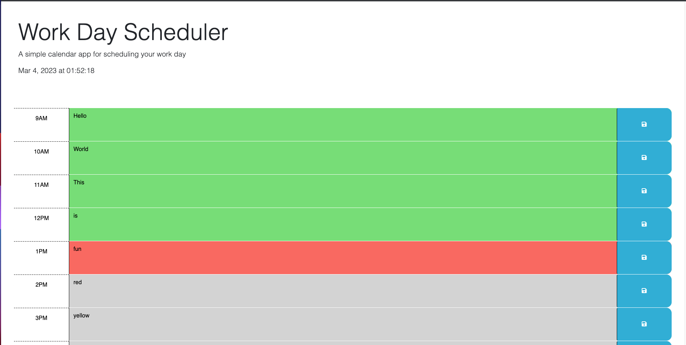

## Table of Contents
  * [License](#License)
  * [Title](#Title)
  * [Description](#Description)
  * [Installation](#Installation)
  * [Usage](#Usage)
  * [Contribution](#Contribution)
  * [Test](#Test)
  * [Technologies](#Technologies)
  * [Questions](#Questions)
  * [Features](#Features)
  
  ## License
  
  

  # Work Day Schedular 
  ### Grant Ellington
  ## Description
  
  The is an app the you can  save notes  to a daily calendar and  the  blocks keep track of the current time.
  
  ## Installation
  
  Follow the deployed link and start using

  

  [Deployed Link](https://grant-ellington.github.io/Work-Day-Scheduler/)
  
  ## Usage Information
  
  n/a
  
  ## Contribution 
  
  n/a
  
  ## Test
  
  n/a
  
  
  ## Technologies
  Project is created with:
  * HTML
  * JS
  * jQuery
  ## Set-up
  
  
  ## Questions
  Grant-Ellington
  [gellingtonem6@gmail.com](gellingtonem6@gmail.com)

  ## Features
  * a clock which updates automatically
  * color sections to show past, present and future.
  * the use of local storage to keep notes as persistent data